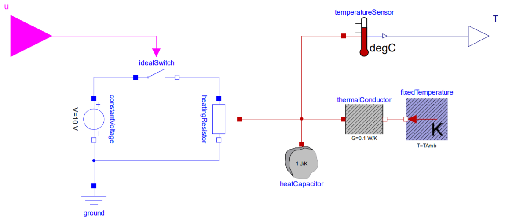
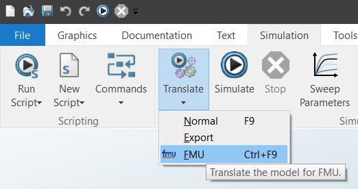
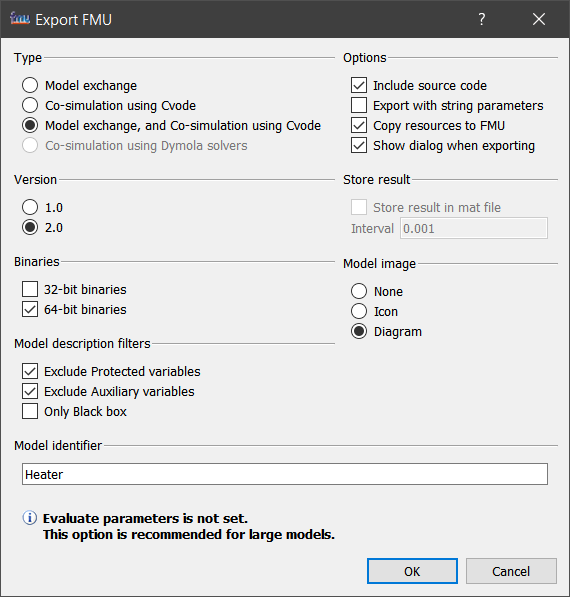

# Building a standalone app from a source code FMU

This project demonstrates how to simulate an [FMI 2.0](https://fmi-standard.org/) source code FMU as a standalone app.
It consists of a [simple C program](src/simulator.c) that creates an instance of the `Heater` model. Its simulation loop turns the power for the `heatingResistor` on and off by setting the input variable `u` to keep the temperature `T` of the `heatCapacitor` at 40 °C.



For each time step the current simulation time, `u` and `T` are displayed on the command line:

```
time, u, T
0.00, 0, -7.15
0.10, 0, 20.72
0.20, 0, 21.43
0.30, 0, 22.14
...
3.40, 0, 39.82
3.50, 1, 40.28
3.60, 1, 40.73
3.70, 1, 40.26
3.80, 0, 39.79
3.90, 0, 39.32
4.00, 0, 39.78
4.10, 1, 40.23
4.20, 1, 40.68
4.30, 1, 40.21
4.40, 0, 39.74
...
```

## Project Structure

- `Heater.mo` - Modelica model of the Heater
- `model/` - extracted FMU (exported with Dymola 2021)
- `include/fmi2*.h` - FMI headers
- `include/model.h` - model specific constants
- `src/simulator.c` - source code of the standalone app
- `CMakeLists.txt` - the CMake project

## Building the Standalone App

### Prerequisites

- a clone or extracted download of this repository
- [CMake](https://cmake.org/) to generate the Visual Studio solution on Windows or Makefiles on Linux 
- a supported toolchain to build the App (run `cmake --help` to get a list of all available generators)
- [Dymola](https://www.3ds.com/products-services/catia/products/dymola/trial-version/) to export the FMU (optional)
- Python and [FMPy](https://github.com/CATIA-Systems/FMPy) to reimport the FMU (optional)

### Building on Windows with Visual Studio

- run `cmake -G"Visual Studio 15 2017 Win64" -Bbuild .` to generate a Visual Studio 2017 solution

- open `build/simulator.sln` in Visual Studio 2017

- In the Project Explorer right-click on the `simulator` project and select `Debug > Start new instance` to build and run the app

### Building on Linux with GCC

- run `cmake -Bbuild .` to generate the Unix Makefiles

- run `cmake --build build` to build the app

- run the app with `./build/simulator`

### Exporting the FMU

- in Dymola 2021 click `File > Open > Load...` and select `Heater.mo`

- on the `Simulation` tab open the `Translate` menu and select `FMU`



- in the `Export FMU` select the following options and click `OK`



### Reimporting the FMU

To reimport the FMU run the following command

```
python import_fmu.py Heater.fmu
```

This will extract `Heater.fmu` to the `model` directory and create a `include/model.h` with the model specific constant.
The script requires Python and [FMPy](https://github.com/CATIA-Systems/FMPy).
